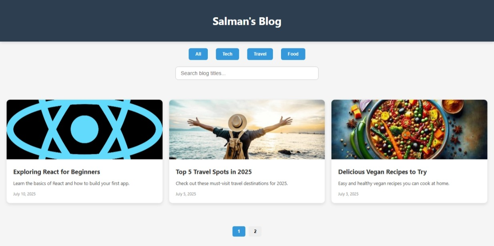

# 📝 Personal Blog Homepage — Elevvo Internship Task

This is _Task 4_ of my Elevvo Front-End Web Development Internship — a fully responsive personal blog homepage that displays blog posts using a card layout with filtering, search, and pagination features.

---

## 🚀 Features

- 🧭 Category filter buttons (Tech, Travel, Food)
- 🔍 Live search to filter posts by title keyword
- 📑 Paginated post display (3 per page)
- 📱 Fully responsive design
- ❌ "No posts found" message for empty searches
- 💅 Clean and modern layout using CSS Grid and Flexbox

---

## 🧠 Technologies Used

- _HTML5_
- _CSS3_
- _JavaScript (Vanilla)_
- _Responsive Design (Media Queries, Flexbox, CSS Grid)_

---
## 🔗 Live Demo

👉 [Click here to view live site](https://muhammad-salman123.github.io/BlogPage-elevvo-task/)

## 📸 Screenshots

